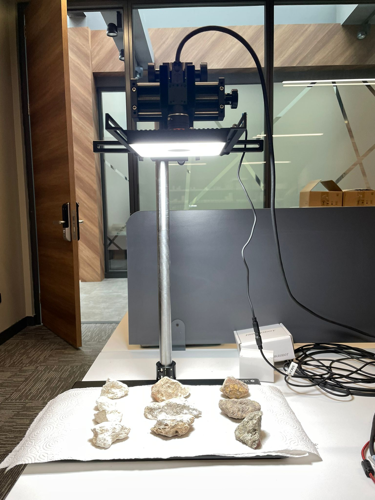
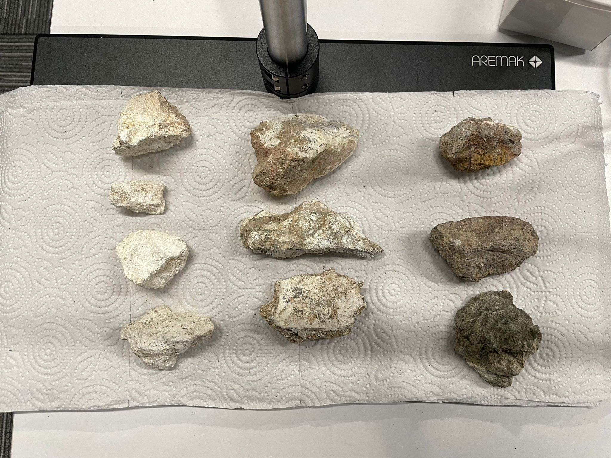

# Rock Classification

A project I coded while working at Aremak, Turkey.

## What it does
1) Firstly, it connects to an external camera that is attached to the computer. The camera should have the rocks to classify in its view.

2) Then, you can choose whether to use average HSV values of the selected region or histogram values of the selected region for classification (histogram will have more accuracy but higher number of features in KNN model).

3) With classification, it can classify the different types of rocks by using their HSV color values.

## How to use
1) Install the dependencies like numpy, pandas, sklearn.
   
2) Make sure the external camera is connected and setup with proper lighting/exposure.
   
3) Run `classifyAvg.py` to classify using average values, or `classifyHistogram.py` to classify using a histogram of the region.

4) A window will pop up, you can click on the region which you want to scan for classification, and it will give the prediction.

## Equipment/Technologies used:
- 📷 **Camera Model:** Hikrobot MV-CS060-10UC-PRO
- 🔬 **Lens:** MVL-HF0828M-6MPE
- 🏗 **Camera Stand:** Aremak Adjustable Machine Vision Test Stand
- 💡 **Lighting:** Hikrobot Shadowless Ring Light(MV-LGES-116-W)
- 🖥️ **Operating System:** Windows
- 🔧 **Software Tools:** Python, OpenCV, Hikrobot SDK, CSV, Pandas, scikit-learn

## Setup photos

Image of the camera setup:

Image of the rocks used for training and testing:

## Acknowledgment
🏢 This project was developed during an internship at [Aremak Bilişim Teknolojileri](https://www.aremak.com.tr) under the supervision of Emrah Bala.
